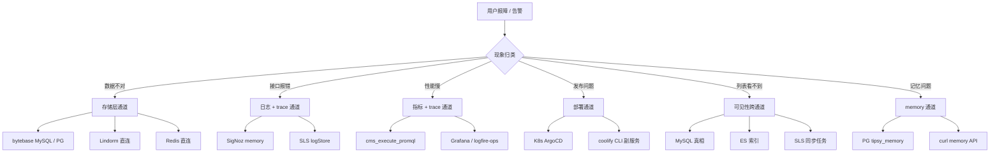

# 排障决策树

这份文档是 tipsy-oncall skill §0 的详细展开。当值班同学接到用户报障、告警群冒烟、甚至只是自己刷指标发现异常时，先读这一份判定要走哪条通道、需要打开哪些 references。目标是 5 分钟内把"看起来一团糟的现象"拆到一两个明确的排查通道，避免全站乱翻，也避免直接扎进单一存储得出以偏概全的结论。

## 一、现象 → 问题类型 → 通道

先把用户描述归一到六大类，这一步是骨架，细枝末节靠对应 references。

- **数据不对**（用户看到某字段值错了、列表缺条目、聊天记录没了、账单不对）：走 MySQL / PG / Lindorm 三存储通道，先看 llmdoc/architecture 里的分层。核心 references：`mysql-postgres.md`、`lindorm.md`、`redis.md`（缓存脏）。
- **HTTP / 接口报错**（前端 5xx、gin 层 panic、SSE 断流）：走 SigNoz + SLS 日志双通道，交叉验证。核心 references：`signoz.md`、`sls-logs.md`。
- **性能 / 时延**（用户说慢、看板 p99 突刺、SLO 告警）：先看 Grafana / logfire-ops 定位受影响接口，再下钻到 trace。核心 references：`prometheus.md`（注意 SKILL §1 铁律 7：http 与 gin 时延指标覆盖不同）、`signoz.md`。
- **部署 / 发布**（preview 打不开、K8s 主链路挂、副服务如 Prometheus 报错）：主链路走 K8s 侧，副服务走 coolify CLI，二者不能混用。核心 references：`coolify.md`。
- **可见性问题**（角色不显示在 trending / latest / web、搜不到、后台看着有前台没有）：典型跨通道，MySQL 查真相、ES 查索引、SLS 查同步日志三处都要看，详见文末案例。核心 references：`elasticsearch.md`、`mysql-postgres.md`、`sls-logs.md`。
- **记忆 / mempoint**（记忆丢了、召回不准、召回时序不对、reset_oc 后还残留）：走 PG（tipsy_memory 库）+ memory HTTP API 双查，注意 SLS 里 ingest 是静默的（SKILL §1 铁律 8）。核心 references：`memory-direct.md`、`mysql-postgres.md`。

无法归类时的兜底顺序：先看告警明确指向 → 看 SLS 5xx → 看 SigNoz trace → 反问用户澄清。

## 二、Mermaid 决策分支

## 三、多通道命中时的澄清话术

用户报障常常一句话说不清，例如"读一下告警"可能指 Grafana 告警群、CodeX PR 告警、logfire 告警三处不同来源。命中歧义时，先反问再动手：

- **告警来源**："这条告警是从哪个群转过来的？Grafana 值班群 / logfire 告警群 / CodeX PR？"
- **环境**："你截图看到的问题是 prod 还是 test？URL 里是 api.fantacy.live 还是 api.dev.fantacy.live？"
- **角色 / 用户**："能给一个具体的 character_id 或 user_id 吗？我拿这个做定位，比全表扫要快。"
- **时间窗**："这个现象从什么时候开始？最后一次好是什么时候？"

反问优先于动手，但反问不能超过 3 轮 —— 3 轮还不清就自己按最可能的一路先查，把假设写在报告里让用户纠正。

## 四、MCP 断线的降级流程

MCP 有可能因为 token 过期、代理断线、上游限流失联。降级顺序：

1. 先重试一次：等待约 15 秒后再次调用同一个 MCP 工具，给自动重连留时间。
2. 提示用户重新授权：如果两次仍失败，回复用户"XX MCP 疑似断线，请去浏览器扩展或 IDE 面板重新授权，或者手动执行 `source secrets.sh`"。
3. 手动 curl 兜底：能用直连的场景优先直连（Redis、ES、memory API 都有直连方案），用 `$ALIYUN_ACCESS_KEY_ID` / `$TIPSY_MEMORY_URL_PROD` 这类 env 变量拼命令，不落盘任何 token。
4. Chrome 兜底：走 nimbalyst-browser MCP 的 `browser_evaluate` 注入 hook 抓 XHR，详见 nimbalyst-browser 兜底(SKILL.md §4)。
5. 全部失败则终止排查，把已获取的证据写到五段报告的"证据链"里，让用户人工继续。

## 五、prod / test / preview 环境路由 checklist

动手前必须先确认环境，SKILL §1 铁律 2 已强调过。快速自检：

- **prod**：MySQL 实例 `tipsy-backend-prod-mysql-sj6z`、库名 `tipsy`；Lindorm 库 `tipsy`；SLS project `k8s-log-cdabe95251a0843e983951d48046d1b21`、logStore `tipsy-chat`、region `us-east-1`；API 域名 `api.fantacy.live`。
- **test**：MySQL 实例 `tipsy-backend-test-mysql-v8kd`、库名 `fantasy`；Lindorm 库 `fantacy`（注意拼写）；SLS project `k8s-log-cbcdd4ec548224346a094bd067f3ade17`、logStore `lightspeed-hk`、region `cn-hongkong`；API 域名 `api.dev.fantacy.live`。
- **preview**：URL 形如 `{commit_id}-{build_number}.api.dev.fantacy.live`，数据打到 test 存储，但服务实例是 preview 独立的 —— 排查 preview 报错时代码可能是分支代码，别对着 dev 主干找 bug。
- **memory PG**：两套环境都指向 `tipsy-memory` 实例（库 `tipsy_memory`），靠 `$TIPSY_MEMORY_URL_PROD` / `$TIPSY_MEMORY_URL_TEST` 区分。

## 六、跨通道案例：角色在 trending / latest / web 消失

- 现象：用户反馈某 character 在 trending 页看不到、后台却是可见状态。
- 通道：MySQL 查 character 表真相 → ES 查索引是否同步 → SLS 查同步任务日志。
- 查询：`bytebase.query_database` 拉 character 行确认 visibility 字段 → curl ES `_search` 用同一个 id 检查是否命中 → 用 `mcp__aliyun-sls__sls_execute_sql` 查 sync worker 报错。
- 结论：此前定位是 NSFW / Limitless 筛选精确匹配 bug 叠加编辑回退导致 ES 出索引失败，MySQL 是对的但 ES 没跟上，只看单一通道会误判为"数据对但前端 bug"。详见项目记忆 `character-visibility-rootcause.md`。

## 下一步 / 相关

- 存储：`mysql-postgres.md`、`lindorm.md`、`redis.md`、`elasticsearch.md`
- 日志与 trace：`sls-logs.md`、`signoz.md`
- 指标与告警：`prometheus.md`、`logfire.md`
- 部署：`coolify.md`
- 记忆：`memory-direct.md`
- 兜底：nimbalyst-browser 兜底(SKILL.md §4)、`environments.md`
- 报告模板：`report-format.md`